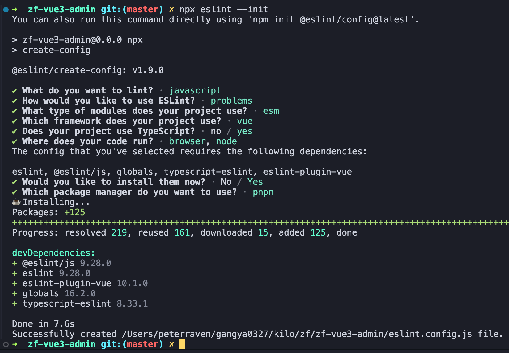

## 特性
- node 18+（本项目 20.18.1）
- pnpm 包管理工具
- vite 构建工具
- vue 3.5+
- eslint 9.28.0
- prettier
- husky + commitlint

## 项目搭建

### 创建项目

`pnpm create vite`
依次选择：vue, typescript

### 安装 eslint

`npx eslint --init`


### 安装 prettier

`pnpm install prettier eslint-plugin-prettier eslint-config-prettier -D`

创建 `prettier.config.js` 文件

```js
export default {
  singleQuote: false, // 单引号
  semi: false, // 语句后面是否需要分号
  tabWidth: 2,
  trailingComma: "none",
  useTabs: false,
  endOfLine: "auto",
};
```

*⚠️ 注意：`eslint-plugin-prettier/recommended`的配置会移除规则，可能会影响自定义 rules*

### 配置 editorconfig

```
root = true
[*]
charset = utf-8
indent_style = space
indent_size = 2
end_of_line = lf
```

### 安装 husky
`pnpm i husky lint-staged -D`

在 `package.json` 中添加以下内容：
```json
"lint-staged": {
  "src/**/*.{js,cjs,ts,vue}": [
    "npx eslint --fix"
  ],
  "src/**/*.{html,json,css,scss,}": [
    "npx prettier --write"
  ]
}
```
初始化 `npx husky init`

*⚠️ 注意：需要放在 git 仓库根路径下，否则可能不执行钩子函数*

### 规范提交信息 commitlint

`pnpm install @commitlint/cli @commitlint/config conventional -D`

添加 `commit-msg` 钩子

## 基础构建

### 安装路由

`pnpm i vue-router`

### 安装 Pinia

`pnpm i pinia`

### 安装 element-plus

`pnpm i element-plus`

### 设置路径别名 alias

`vite.config.ts` 文件
```
resolve: {
  alias: [
    {
      find: "@",
      replacement: path.resolve(__dirname, "src")
    }
  ]
},
```

`tsconfig.app.json` 文件
```
"baseUrl": ".",
"paths": {
  "@/*": ["src/*"]
},
```

## 页面样式开发

### 布局页面 layout

### 安装 Sass

`pnpm i sass -D`

### 安装 UnoCSS

`pnpm i unocss @unocss/transformer-directives -D`

`uno.config.ts` 文件
```ts
import { defineConfig, presetWind3, presetAttributify } from "unocss"
import transformerDirectives from "@unocss/transformer-directives"

export default defineConfig({
  presets: [presetWind3(), presetAttributify()],
  transformers: [transformerDirectives()] // 类似 apply
})
```

`vite.config.ts` 文件

```ts
import UnoCSS from "unocss/vite"

plugins: [
  UnoCSS()
]
```

`main.ts` 文件

```ts
import 'virtual:uno.css'
```

### 样式清除

`pnpm i normalize.css`

### Element Plus 按需引入

`pnpm install -D unplugin-vue-components unplugin-auto-import`

`vite.config.ts` 文件

```ts
import AutoImport from "unplugin-auto-import/vite"
import Components from "unplugin-vue-components/vite"
import { ElementPlusResolver } from "unplugin-vue-components/resolvers"

plugins: [
  AutoImport({
    resolvers: [ElementPlusResolver()] // 解析 api
  }),
  Components({
    resolvers: [ElementPlusResolver()] // 解析组件
  })
]
```